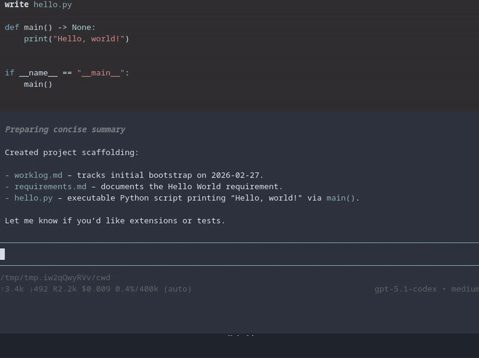

# pi-open-sessions-files-extension

Extension for pi that lists files edited/written by the agent in the current session and opens a fuzzy picker.

## Demo



## Layout

- `open-session-files.ts` — extension source

## Development

1. Edit `open-session-files.ts` in this repo.
2. Quick isolated manual test (recommended):

```bash
npm run dev:sandbox
```

This launches pi in a temporary sandbox (isolated config/session/resources) and loads only this extension.

3. For your regular pi instance, run `/reload` to pick up changes.

## Install / use in pi

### Option 1: copy the source file

```bash
cp ./open-session-files.ts ~/.pi/agent/extensions/open-session-files.ts
```

Then run `/reload` in pi.

### Option 2: install as a pi package

```bash
pi install npm:pi-open-sessions-files-extension
```

Or add in settings:

```json
{
  "packages": ["npm:pi-open-sessions-files-extension"]
}
```

## Config: open command

By default, selected files are opened with:

- `$VISUAL` or `$EDITOR` (fallback: `vi`)

Default shortcut:

- `Alt+O` (chosen to avoid pi default `Alt+F` cursor-word-right conflict)

You can customize the launch command with one of (highest priority first):

1. Env vars:
   - `PI_OPEN_FILE_COMMAND`
   - `PI_OPEN_FILE_MODE` (`foreground` or `background`)
   - `PI_OPEN_FILE_SHORTCUT` (e.g. `alt+o`, `ctrl+shift+o`)
2. Main pi project settings:
   - `.pi/settings.json`
3. Main pi global settings:
   - `~/.pi/agent/settings.json`

### Config schema

```json
{
  "openSessionFiles": {
    "openCommand": "your shell command",
    "openMode": "foreground",
    "shortcut": "alt+o"
  }
}
```

Supported placeholders:

- `{file}` → shell-escaped selected file path
- `{cwd}` → shell-escaped current project cwd

Open modes:

- `foreground` (default): pauses pi TUI, runs command attached to terminal (best for plain `$EDITOR`)
- `background`: launches command detached without pausing TUI (best for tmux split workflows)

## Example: open in a tmux right pane

Put this in `~/.pi/agent/settings.json` (or project `.pi/settings.json`):

```json
{
  "openSessionFiles": {
    "openCommand": "tmux split-window -h -c {cwd} \"${EDITOR:-nvim} {file}\"",
    "openMode": "background"
  }
}
```

If your command does not reference `{file}`, the extension auto-appends the selected file path.
